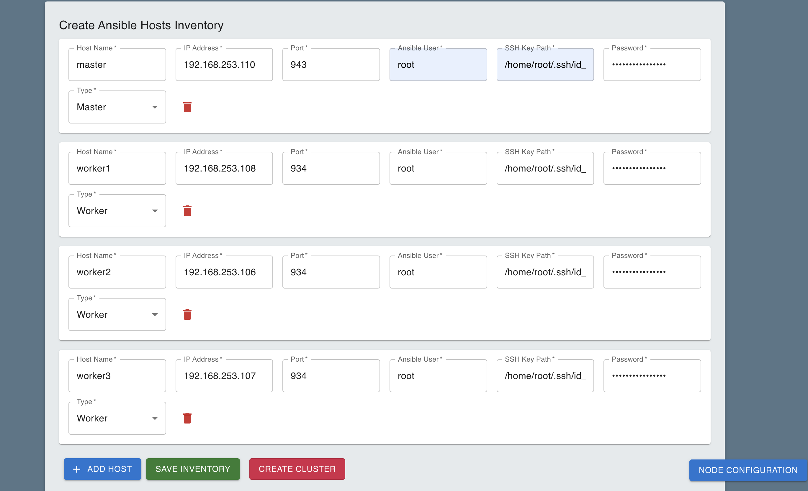

# Blockchain Management Platform

A personal project that provides a platform to create, manage, and monitor blockchain networks through API endpoints. The system consists of a Go backend server and a React frontend, orchestrated using a Makefile for easy setup and management. This guide includes instructions tailored for Visual Studio Code (VS Code) users.

## Table of Contents

- [Introduction](#introduction)
- [Project Structure](#project-structure)
- [ServerConfig Component](#serverconfig-component)
  - [Features](#features)
  - [How It Works](#how-it-works)
  - [Usage](#usage)
- [Makefile Commands](#makefile-commands)
- [API Endpoints](#api-endpoints)
- [Getting Started](#getting-started)
  - [Installation](#installation)
- [Usage](#usage)
- [License](#license)
- [Contact](#contact)

## Introduction

This project aims to simplify the process of deploying and managing blockchain networks. By utilizing a Go backend and a React frontend, users can interact with the system through a user-friendly interface or API calls. The Makefile included in the project provides convenient commands for installing dependencies, running servers, and cleaning up the environment.

## Project Structure

```plaintext
.
├── Backend/          # Go backend server code
├── Frontend/         # React frontend application
├── hosts.ini         # Ansible inventory file (auto-generated)
├── Makefile          # Makefile with predefined commands
└── README.md         # Project documentation
```

## Makefile Commands

The `Makefile` includes several commands to simplify project setup and management.

### Installation Commands
Install All Dependencies

Installs both backend and frontend dependencies.

```bash
make install-all
```

### Clean All Dependencies
Deletes both backend and frontend dependencies and removes the `hosts.ini` file if it exists.

```bash
make clean-all
```

### Running Servers

Run Backend Server

```bash
make backend-run
```

### Run Frontend Server
```bash 
make frontend-run
```

# ServerConfig Component

## Overview

`ServerConfig` is a React component designed to dynamically generate and manage an **Ansible inventory** file through a form-based user interface. It allows users to create multiple server configurations (master and worker nodes) and submit them as a JSON payload to a backend API. The backend then converts this payload into an Ansible-compatible `hosts.ini` file.

Ansible is a popular automation tool used for configuration management, application deployment, and task automation. It operates by executing tasks on hosts (nodes) listed in an inventory file. This component simplifies the process of building that inventory by enabling users to enter details about each node in the infrastructure dynamically.

## Features

### 1. Dynamic Form Creation

- **Add Hosts**: Users can add as many hosts as needed by clicking the **"Add Host"** button.
- **Host Details**: Each host corresponds to a server (e.g., master or worker) with required details such as:
  - `name`: Unique identifier for each host.
  - `ip`: IP address of the server.
  - `port`: SSH port for connection (default is 22).
  - `ansible_user`: The user account Ansible will use to execute commands.
  - `password`: SSH password for authentication and privilege escalation.
  - `ssh_private_key_file`: Path to the SSH private key file for authentication.
  - `type`: Specifies whether the node is a **master** or **worker**.
- **Remove Hosts**: Each host can be removed by clicking the red trash icon (Delete).
- **Validation**: The form ensures all fields are required before submission.

### 2. Ansible Host Configuration

- **Data Collection**: The data entered by the user forms the basis of an Ansible inventory.
- **Inventory Data Includes**:
  - **Host Name**: Unique identifier for each host in Ansible.
  - **IP Address**: The IP address Ansible will use to connect to the node.
  - **Port**: SSH port for the connection.
  - **Ansible User**: The user account on the server that Ansible will use.
  - **SSH Key Path**: Path to the SSH private key file for authentication.
  - **Password**: SSH password for authentication and privilege escalation.
  - **Type**: Whether the node is a **master** or **worker** in the infrastructure.

### 3. Submitting Inventory

- **Form Submission**: Upon form submission, the collected inventory data is sent as a JSON payload to the backend API `/api/saveInventory` via a `POST` request.
- **Backend Processing**: The API processes the data and generates an Ansible-compatible `hosts.ini` file.
- **Ansible Integration**: The generated `hosts.ini` file is used by Ansible to define which machines to interact with during automated tasks.

## How It Works

1. **User Interaction**: Users interact with the form to add or remove hosts and fill in the required details for each.
2. **State Management**: The component maintains the state of all hosts entered, updating as the user adds or removes hosts.
3. **Validation**: Before submission, the form validates that all required fields are filled out.
4. **Data Submission**: On submission, the component sends the host data as a JSON payload to the backend API.
5. **Backend Conversion**: The backend converts the JSON payload into an Ansible `hosts.ini` file.
6. **Automation Ready**: The `hosts.ini` file is now ready for use with Ansible playbooks for automation tasks.

## Usage

### Importing the Component




- Save Inventory: (Button) Captures and saves the server configuration as an Ansible-compatible inventory file (hosts.ini) on the backend, defining which servers Ansible will manage.

- Create Cluster: (Button) Executes Ansible playbooks to configure and deploy the cluster using the saved inventory, automating the setup of master and worker nodes. This step is only enabled after saving the inventory.